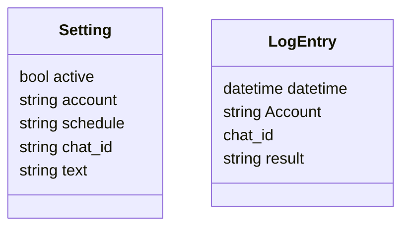
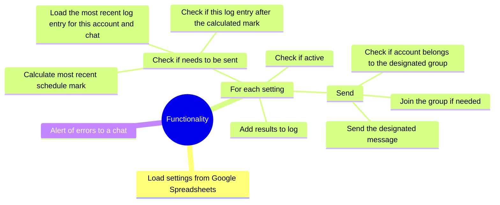

The whole app is a container run periodically that uses designated telegram user accounts to post designated messages to designated telegram groups acoording to a designated schedule.

# Classes


Settings are stored in a Google Sheets table.

Log entries are stored in a supabase table.

Schedules use cron notation.

Environment configuration (in `.env`):

```
# Preferred: path to Google service account JSON file
GOOGLE_SERVICE_ACCOUNT_FILE=google-service-account.json

# Legacy fallback: inline JSON string
# GOOGLE_SERVICE_ACCOUNT={"type":"service_account", ...}

API_ID=...
API_HASH=...
SUPABASE_URL=...
SUPABASE_KEY=...
```

# Functionality

