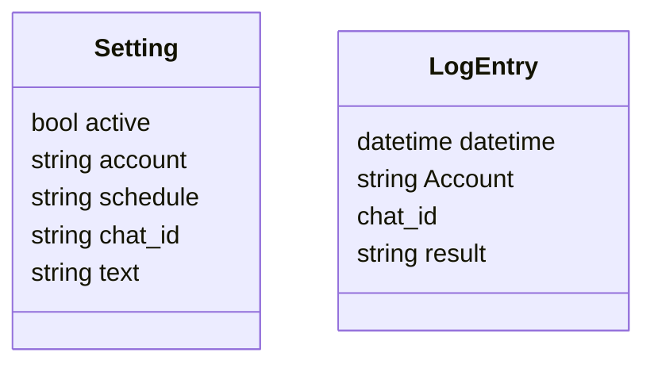
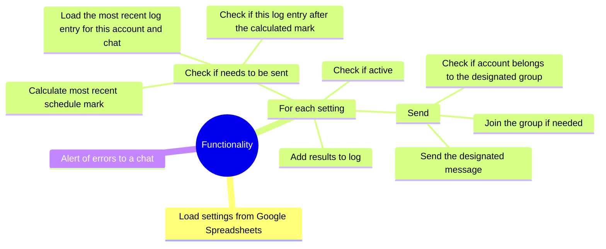

The whole app is a container run periodically that uses designated telegram user accounts to post designated messages to designated telegram groups according to a designated schedule.

## Forum Topic Support

The system now supports sending messages to specific topics within Telegram forum groups. Use the format `chat_id/topic_id` in the `chat_id` field of your settings:

- **Format**: `chat_id/topic_id`
- **Examples**: 
  - `@mychannel/123` - Send to topic 123 in @mychannel
  - `-1001234567890/456` - Send to topic 456 in group -1001234567890
- **Backwards Compatible**: Regular chat IDs without `/` continue to work as before
- **Topic ID**: The topic ID is the message ID of the first message in the forum topic thread

### How to Get Topic ID

1. Open the forum topic in Telegram
2. Right-click on any message in the topic and select "Copy message link"
3. The link format is: `https://t.me/c/CHAT_ID/TOPIC_ID/MESSAGE_ID`
4. The `TOPIC_ID` is the number you need for the `chat_id/topic_id` format

### Examples

- Regular chat: `@mychannel` or `-1001234567890`
- Forum topic: `@mychannel/123` or `-1001234567890/456`

# Classes


Settings are stored in a Google Sheets table.

Log entries are stored in a supabase table.

Schedules use cron notation.

Environment configuration (in `.env`):

```
# Preferred: path to Google service account JSON file
GOOGLE_SERVICE_ACCOUNT_FILE=google-service-account.json

# Legacy fallback: inline JSON string
# GOOGLE_SERVICE_ACCOUNT={"type":"service_account", ...}

API_ID=...
API_HASH=...
SUPABASE_URL=...
SUPABASE_KEY=...
```

# Functionality

