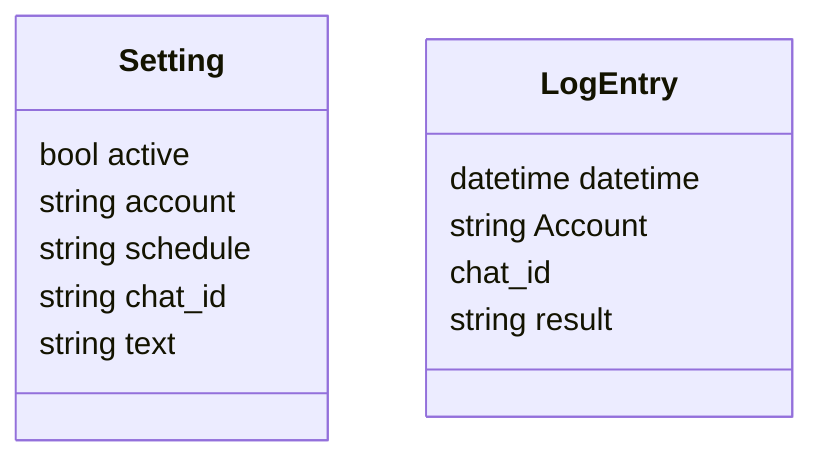
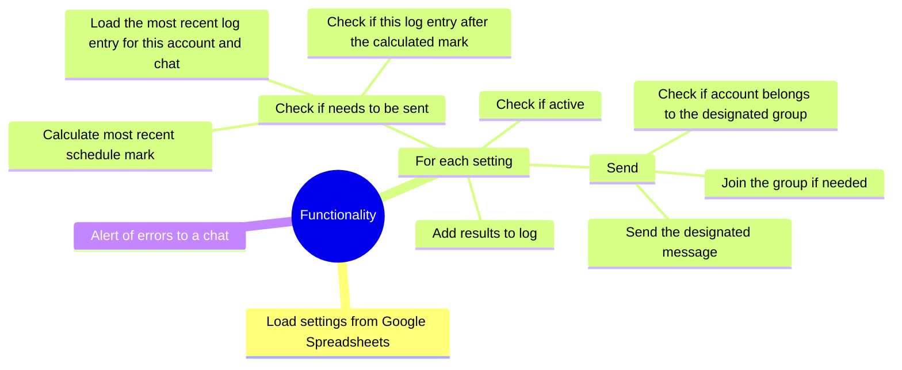

The whole app is a container run periodically that uses designated telegram user accounts to post designated messages to designated telegram groups acoording to a designated schedule.

# Classes

Settings are stored in a Google Sheets table.

Log entries are stored in a supabase table.

Schedules use cron notation.

# Functionality

