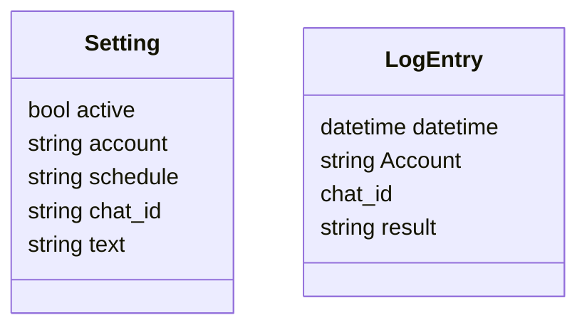
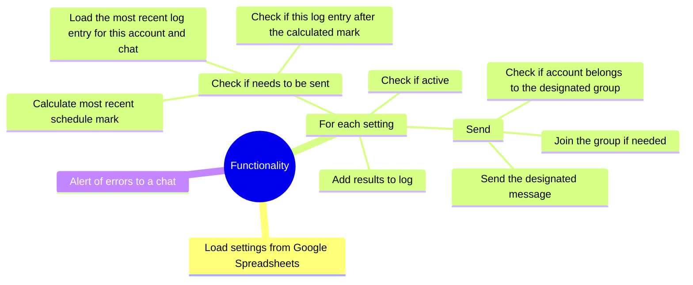

# System Patterns

## Architecture Overview
The system follows a client-settings pattern inside a single `src/` package:
- **core**: domain models (`Setting`, `Client`) and configuration loading
- **messaging**: orchestration (`orchestrator.py`), transport (`sender.py`), and error handling helpers
- **infrastructure**: Supabase log adapter
- **monitoring**: alert publishing
- **scheduling/utils**: cron utilities and Telegram helpers
- **Clients** contain multiple **Settings**; each setting controls one scheduled task
- **Accounts** handle the actual Telegram operations

### Module Boundaries
- `messaging.orchestrator.process_setting_outer` coordinates scheduling checks, dispatch, and logging
- `messaging.sender.send_setting` encapsulates send/forward logic and media group handling
- `messaging.error_handlers.handle_slow_mode_error` centralizes schedule auto-adjustment
- `core.config.get_settings()` exposes validated environment variables to all packages
- `monitoring.stats_publisher.AlertManager` encapsulates alert account management and publishing
- `cli.create_sender_account` centralizes account creation with proper credentials

## Key Design Patterns

### Auto-Join Pattern
```python
async def send_message(self, chat_id, text, reply_to_msg_id=None):
    try:
        return await self.app.send_message(chat_id, text, reply_to=reply_to_msg_id)
    except ChatWriteForbiddenError:
        await self._join_chat(chat_id)  # Auto-join on permission error
        return await self.app.send_message(chat_id, text, reply_to=reply_to_msg_id)
```

### Media Group Handling
- Detects grouped messages by `grouped_id` attribute
- Forwards entire media groups together
- Uses optimized centered window approach (20-message window) with global caching
- **Global Album-Level Caching**: Prevents redundant API calls for same media groups
- **URL Query Parameter Support**: Strips query parameters (like `?single`) before URL parsing to ensure media groups are properly detected and forwarded
- **Real-World Validation**: Integration tests confirm complete forwarding with captions preserved

### Error Recovery
- **Slow Mode**: Auto-adjusts cron schedules for all settings in the same chat, always provides user feedback in Google Sheets (Russian messages)
- **Permission Errors**: Attempts to join chat and retry
- **Media Errors**: Handles incomplete media groups gracefully

### Alert Account Management
- **AlertManager Class**: Dedicated class for alert account lifecycle management
- **Separate Authentication**: Alert accounts handled separately from main account collection to avoid session conflicts
- **Centralized Account Creation**: `create_sender_account` function provides consistent account instantiation
- **Revalidate on Use**: Alert accounts use `revalidate=True` for on-demand authentication
- **Clean Separation**: Alert publishing logic isolated from account management concerns

### Configuration Flow
1. `core.config.get_settings()` loads `.env` once via `pydantic-settings`
2. Load clients from `clients.yaml`
3. Each client loads settings from Google Sheets
4. Process only active settings
5. Update Google Sheets with results/errors

## Critical Implementation Paths

### Message Processing Flow
1. Parse chat_id and optional topic_id
2. **Clean URL by stripping query parameters** (handles `?single` and other params)
3. Determine if forwarding or sending text
4. Join destination chat proactively
5. Execute send/forward operation
6. Handle errors with appropriate recovery

### Deployment Flow
1. **Local Preparation**: Code quality checks, environment validation, optional testing
2. **Package Deployment**: Create and transfer clean tar archive, extract on server
3. **Server Configuration**: Set permissions, build Docker image, configure logging and cron
4. **Clean Logging**: Suppress verbose output from build tools for better user experience

### Schedule Management
- Uses croniter for schedule checking
- Moscow timezone for schedule calculations
- Auto-adjustment for slow mode violations
- 20% buffer added to required intervals

### Logging and Monitoring Patterns
- **Dual Logging**: Both system logs (`/var/log/sender.log`) and Supabase logs
- **Structured Logging**: Consistent format with timestamps and context
- **Error Tracking**: All errors logged with full context and recovery attempts
- **Performance Monitoring**: Execution times and success/failure rates tracked
- **Log Rotation**: Automatic daily rotation with 30-day retention
- **Debug Information**: Detailed logging for troubleshooting and analysis

## Data Models

### Core Classes


## Processing Flow

### Main Functionality


## Forum Topic Support

The system supports sending messages to specific topics within Telegram forum supergroups using the `chat_id/topic_id` format.

### Format Specification
- **Format**: `chat_id/topic_id`
- **Examples**:
  - `@mychannel/123` - Send to topic 123 in @mychannel
  - `-1001234567890/456` - Send to topic 456 in group -1001234567890
- **Backwards Compatible**: Regular chat IDs without `/` continue to work as before
- **Topic ID**: The topic ID is the message ID of the first message in the forum topic thread

### How to Get Topic ID
1. Open the forum topic in Telegram
2. Right-click on any message in the topic and select "Copy message link"
3. The link format is: `https://t.me/c/CHAT_ID/TOPIC_ID/MESSAGE_ID`
4. The `TOPIC_ID` is the number you need for the `chat_id/topic_id` format

### Usage Examples
- Regular chat: `@mychannel` or `-1001234567890`
- Forum topic: `@mychannel/123` or `-1001234567890/456`

